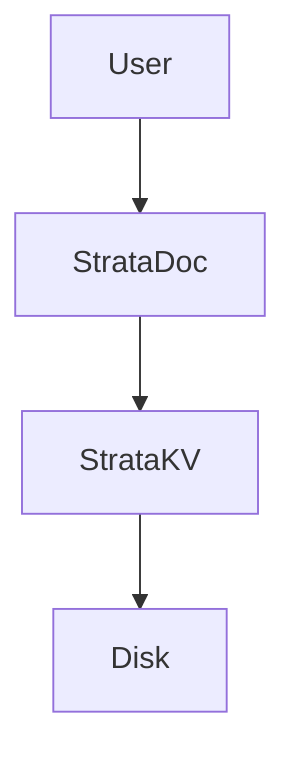

# Strata DB

> *"The layer where your data lives."*

**Strata DB** is an educational project designed to explore and implement the internal storage engines of various database types from scratch. It serves as a playground for understanding the fundamental differences in how Key-Value stores, Document databases, and Relational (SQL) engines manage data on disk and in memory.

---

## 📚 Database Engines

### 1. Strata KV (Implemented)
A high-performance **Log-Structured Merge Tree (LSM-Tree)** engine.
*   **Best for:** High write throughput, simple lookups.
*   **Architecture:** MemTable -> SSTables -> Compaction.
*   **Status:** ✅ Production-ready (Educational).

### 2. Strata Doc (Implemented)
A **JSON Document Store** built on top of Strata KV.
*   **Best for:** Unstructured data, flexible schemas, prototyping.
*   **Features:** `insert`, `find`, `update`, `createIndex`.
*   **Status:** ✅ Production-ready (Educational).

### 3. Strata SQL (Planned)
A relational engine with a SQL parser and query planner.
*   **Best for:** Structured data, complex joins, transactions (ACID).
*   **Status:** 🚧 Planned (Module 3).

---

## 🏗️ Architecture

StrataDB follows a layered architecture. See [docs/architecture.md](docs/architecture.md) for a detailed diagram.



---

## 🚀 Getting Started

### Prerequisites
*   [Bun](https://bun.sh/) (v1.0+)

### Running the Unified CLI
Interact with both the Document and Key-Value layers.

```bash
bun start
# or
bun run src/cli.ts
```

### Supported Commands

**Document Layer (StrataDoc):**
*   `INSERT <collection> <json>` -> Add a document (auto-generates ID).
*   `FIND <collection> [query]` -> Search documents (supports `$gt`, `$in`, etc.).
*   `GET <collection> <id>` -> Retrieve by ID.
*   `INDEX <collection> <field>` -> Create a secondary index for fast lookups.

**Key-Value Layer (StrataKV):**
*   `KV:SET <key> <value>`
*   `KV:GET <key>`
*   `KV:SCAN [prefix]`

### Example Session
```bash
> INDEX users role
> INSERT users {"name": "Neo", "role": "The One", "matrix_version": 6}
> FIND users {"role": "The One"}
```

---

## 🗝️ Strata KV: Deep Dive

The KV engine is the foundation. It implements a classic LSM-tree architecture.

### Features
*   **LSM-Tree Architecture:** Optimized for write-heavy workloads.
*   **MemTable:** In-memory sorted buffer.
*   **SSTables:** Immutable disk-based files.
*   **Bloom Filters:** Probabilistic filtering to eliminate unnecessary disk lookups.
*   **Sparse Indexing:** Metadata files with Min/Max key ranges and Block Offsets.
*   **Compaction:** Automatic background merging of SSTables.

---

## 📄 Strata Doc: Deep Dive

The Document engine adds structure and querying capabilities on top of KV.

### Features
*   **Key Protocol:** Maps `collection` + `id` to encoded KV keys (`users%3A%3A123`).
*   **Secondary Indexing:** Supports `IDX::` keys for O(1) lookups on fields like `email`.
*   **Query Cursors:** Lazy evaluation of queries using Generators.
*   **Advanced Matcher:** Supports MongoDB-style operators:
    *   `$gt`, `$lt`, `$gte`, `$lte` (Comparison)
    *   `$ne` (Not Equal)
    *   `$in`, `$nin` (Array Inclusion)

---

## 🔮 Roadmap

### Module 3: Strata SQL
*   **Lexer & Parser:** Convert SQL strings into an Abstract Syntax Tree (AST).
*   **Query Planner:** Optimize execution (e.g., use `IndexQueryCursor` vs `QueryCursor`).
*   **Executor:** Run the plan against `StrataDoc` or `StrataKV`.

### Future
*   **Dashboard:** A web UI to visualize SSTables, compaction, and query performance.
*   **Transactions:** Implementing ACID properties.