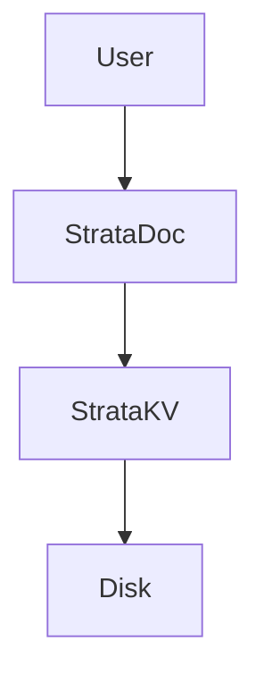

# Strata DB

> *"The layer where your data lives."*

**Strata DB** is an educational project designed to explore and implement the internal storage engines of various database types from scratch. It serves as a playground for understanding the fundamental differences in how Key-Value stores, Document databases, and Relational (SQL) engines manage data on disk and in memory.

---

## 📚 Database Engines

### 1. Strata KV (Implemented)
A high-performance **Log-Structured Merge Tree (LSM-Tree)** engine.
*   **Best for:** High write throughput, simple lookups.
*   **Architecture:** MemTable -> SSTables -> Compaction.
*   **Status:** ✅ Production-ready (Educational).

### 2. Strata Doc (Implemented)
A **JSON Document Store** built on top of Strata KV.
*   **Best for:** Unstructured data, flexible schemas, prototyping.
*   **Features:** `insert`, `find`, `update`, `createIndex`.
*   **Status:** ✅ Production-ready (Educational).

### 3. Strata SQL (Planned)
A relational engine with a SQL parser and query planner.
*   **Best for:** Structured data, complex joins, transactions (ACID).
*   **Status:** 🚧 Planned (Module 3).

## 🌐 StrataUI

StrataDB now includes a modern, Spacetime-inspired web interface for exploring and managing your data.

### Running the UI
To start the StrataUI server:
```bash
bun src/server.ts
```
The UI will be available at [http://localhost:2345](http://localhost:2345).

### Architecture & Future Iterations

#### SpaceManager (Multi-Tenancy)
The backend in `src/server.ts` uses a `SpaceManager` class designed for future cloud offering. Currently, it points to the root `data/` directory, but it is "Space-Aware."

**To enable partitioned rooms/spaces later:**
1. Update `SpaceManager.getSpace(spaceId)` in `src/server.ts`.
2. Change the `dataDir` logic to:
   ```typescript
   const dataDir = path.join("data", "rooms", spaceId);
   ```
3. The UI already passes a `spaceId` query parameter, so you can implement a "Room Switcher" in the frontend to isolate data between different users or projects.

#### WebSocket Telemetry
The UI listens on `/ws` for real-time engine events. You can extend the `broadcast` function in `src/server.ts` to surface more internal engine metrics (like Bloom Filter false positives or Compaction progress).

---

## 🏗️ Architecture

StrataDB follows a layered architecture. See [docs/architecture.md](docs/architecture.md) for a detailed diagram.



---

## 🚀 Getting Started

### Prerequisites
*   [Bun](https://bun.sh/) (v1.0+)

### Running the Unified CLI
Interact with both the Document and Key-Value layers.

```bash
bun start
# or
bun run src/cli.ts
```

### Supported Commands

**Document Layer (StrataDoc):**
*   `INSERT <collection> <json>` -> Add a document (auto-generates ID).
*   `FIND <collection> [query]` -> Search documents (supports `$gt`, `$in`, etc.).
*   `GET <collection> <id>` -> Retrieve by ID.
*   `INDEX <collection> <field>` -> Create a secondary index for fast lookups.

**Key-Value Layer (StrataKV):**
*   `KV:SET <key> <value>`
*   `KV:GET <key>`
*   `KV:SCAN [prefix]`

### Example Session
```bash
> INDEX users role
> INSERT users {"name": "Neo", "role": "The One", "matrix_version": 6}
> FIND users {"role": "The One"}
```

---

## 🗝️ Strata KV: Deep Dive

The KV engine is the foundation. It implements a classic LSM-tree architecture.

### Features
*   **LSM-Tree Architecture:** Optimized for write-heavy workloads.
*   **MemTable:** In-memory sorted buffer.
*   **SSTables:** Immutable disk-based files.
*   **Bloom Filters:** Probabilistic filtering to eliminate unnecessary disk lookups.
*   **Sparse Indexing:** Metadata files with Min/Max key ranges and Block Offsets.
*   **Compaction:** Automatic background merging of SSTables.

---

## 📄 Strata Doc: Deep Dive

The Document engine adds structure and querying capabilities on top of KV.

### Features
*   **Key Protocol:** Maps `collection` + `id` to encoded KV keys (`users%3A%3A123`).
*   **Secondary Indexing:** Supports `IDX::` keys for O(1) lookups on fields like `email`.
*   **Query Cursors:** Lazy evaluation of queries using Generators.
*   **Advanced Matcher:** Supports MongoDB-style operators:
    *   `$gt`, `$lt`, `$gte`, `$lte` (Comparison)
    *   `$ne` (Not Equal)
    *   `$in`, `$nin` (Array Inclusion)

---

## 🔮 Roadmap: Module 3 (Strata SQL)

We are building a Relational Database Engine from scratch. This will be tackled in two major phases:

### Phase 1: The Relational Engine (Structure)
Goal: Support structured data, schemas, and SQL querying.
*   **Lexer & Parser:** Convert raw SQL strings (`SELECT * FROM users`) into an Abstract Syntax Tree (AST).
*   **System Catalog:** Store metadata about tables, columns, and types (`CREATE TABLE`).
*   **Execution Engine:**
    *   **INSERT:** Enforce schema types (e.g., ensure `age` is an Integer) and store rows.
    *   **SELECT:** Implement `Project` (picking columns), `Filter` (WHERE clause), and `Scan` operators.
*   **Query Planner:** Basic optimization of the execution tree.

### Phase 2: The Transaction Manager (Safety)
Goal: Add ACID properties (Atomicity, Consistency, Isolation, Durability).
*   **Atomicity:** Implement `BEGIN`, `COMMIT`, `ROLLBACK`. If a transaction fails, no changes persist.
*   **Isolation:** Implement **MVCC (Multi-Version Concurrency Control)** using Transaction IDs. Readers see a consistent snapshot and never block writers.
*   **Durability:** Leverage the WAL with `BEGIN_TX` and `COMMIT_TX` markers to ensure only fully completed batches are recovered.
*   **Unique IDs:** Utilize `crypto.randomUUID()` for robust transaction identification.

### Future
*   **Dashboard:** A web UI to visualize SSTables, compaction, and query performance.