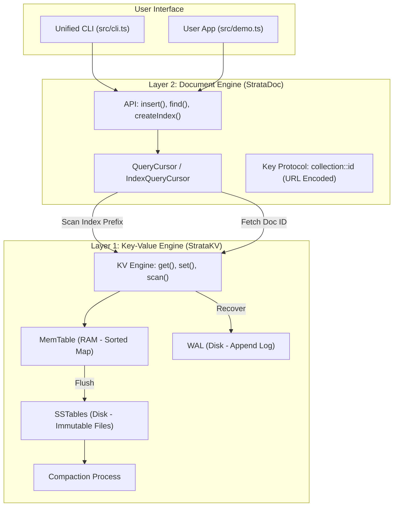

# StrataDB Architecture

This diagram illustrates the layered architecture of StrataDB, showing how user queries flow through the Document Engine down to the physical storage.



## Data Layout on Disk

### Primary Data
Stored as standard Key-Value pairs. The key is namespaced by collection.
```text
users%3A%3A123  ->  {"name": "Alice", "rank": 1, "_id": "123"}
users%3A%3A456  ->  {"name": "Bob",   "rank": 2, "_id": "456"}
```

### Secondary Indexes
Stored as empty-value keys. The document ID is part of the key to allow duplicate values.
```text
IDX%3A%3Ausers%3A%3Arank%3A%3A1%3A%3A123  ->  ""
IDX%3A%3Ausers%3A%3Arank%3A%3A2%3A%3A456  ->  ""
```
